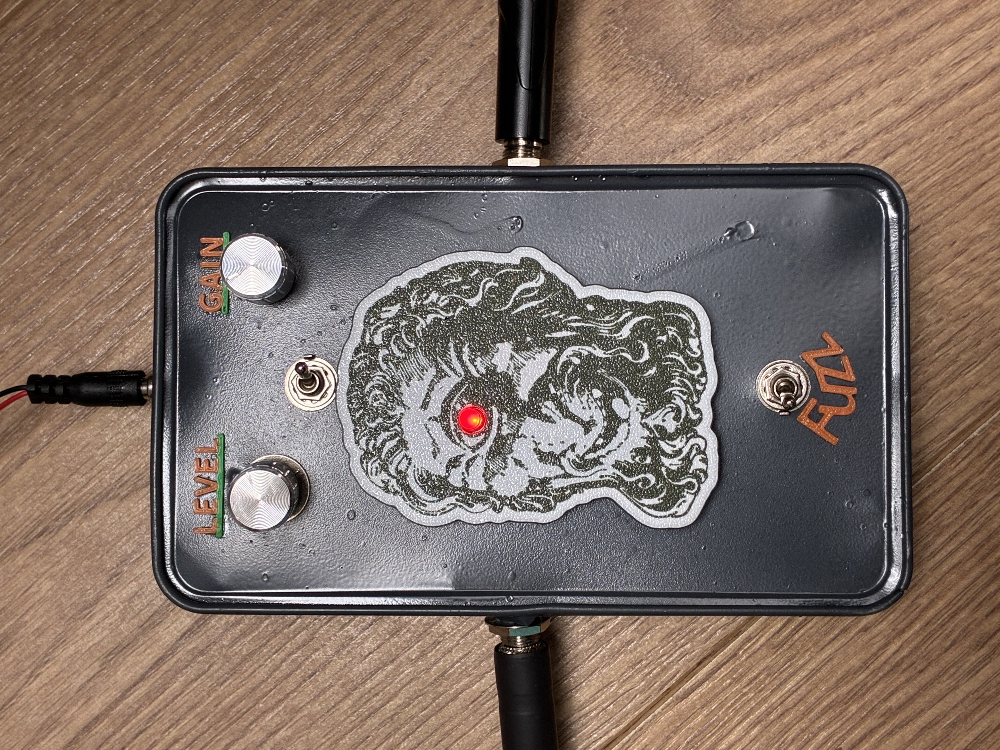

# Fuzz

This was the first guitar effect I ever made...

The circuit combines a **BC337** for the first gain stage and an **MPSA42** for the second, providing a raw, bright, and aggressive fuzz tone.
I added a switch for jumping between the clipping diodes. For my build I used a red LED and a 1N4148 diode.

## Controls

- **Fuzz level** – the amount of volume that goes through the clipping diode. The more power there is, the more will be cut by the diode, creating a more aggressive sound. From my experience fuzz level should be turned all the way up for best results.
- **Gain** – basically the volume. It does not affect the sound characteristic created by the pedal.

## Files

- [`fuzz.kicad_sch`](fuzz.kicad_sch) – schematic (KiCad)
- [`fuzz-demo.mp4`](fuzz-demo.mp4) – audio demo

I must admit the paint job on this was terrible and also cable management could have been much better, but you have to start somewhere!
