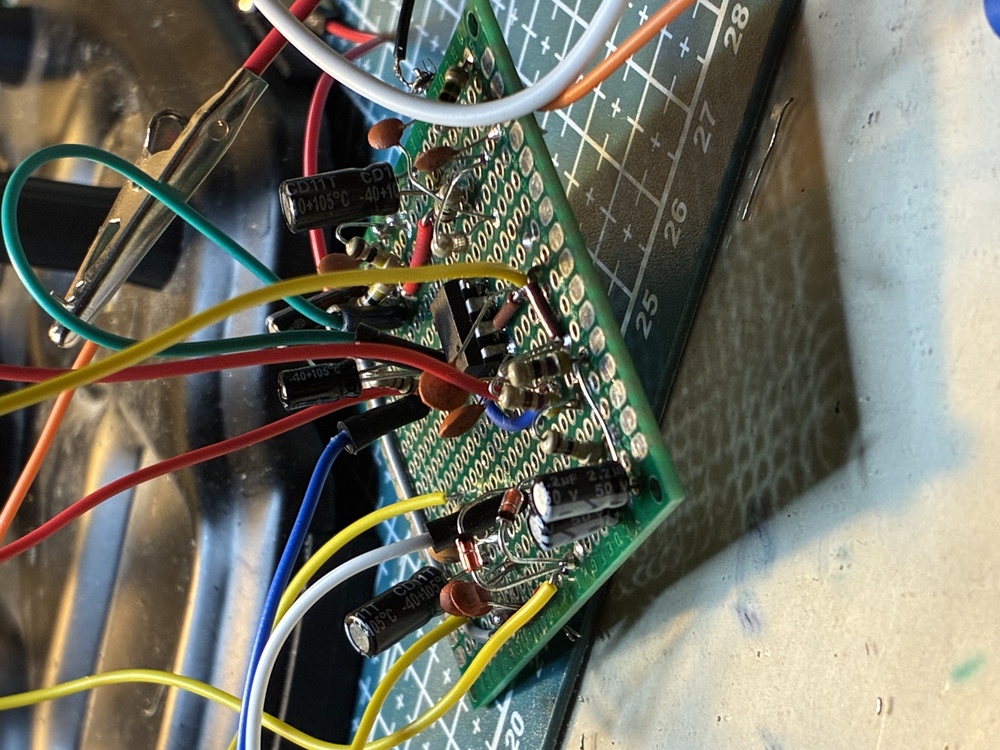

# Rat distortion

This was my 4th build, based on the iconic ProCo RAT.

The heart of this circuit is the **LM308** op-amp, which is the main source of distortion in the circuit. The second source are the clipping diodes.
I wanted to make the circuit more interesting, so I gave red LEDs a try as clipping diodes. The effect? The eyes of the rat on my enclosure glow while playing.
My favourite build so far.

## Build

## Files

- [`rat-enclosure.f3d`](rat-enclosure.f3d) – 3D enclosure design (Fusion 360)
- [`rat-demo.mp4`](rat-demo.mp4) – audio demo
