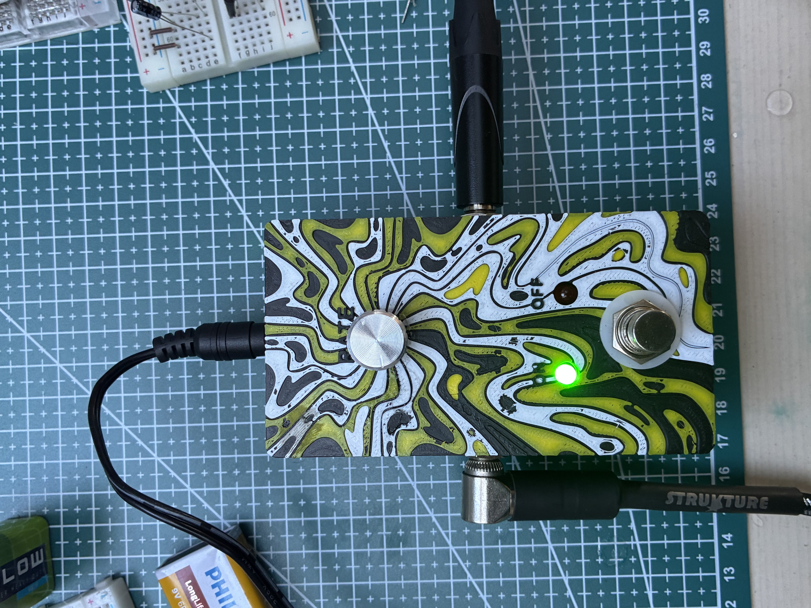
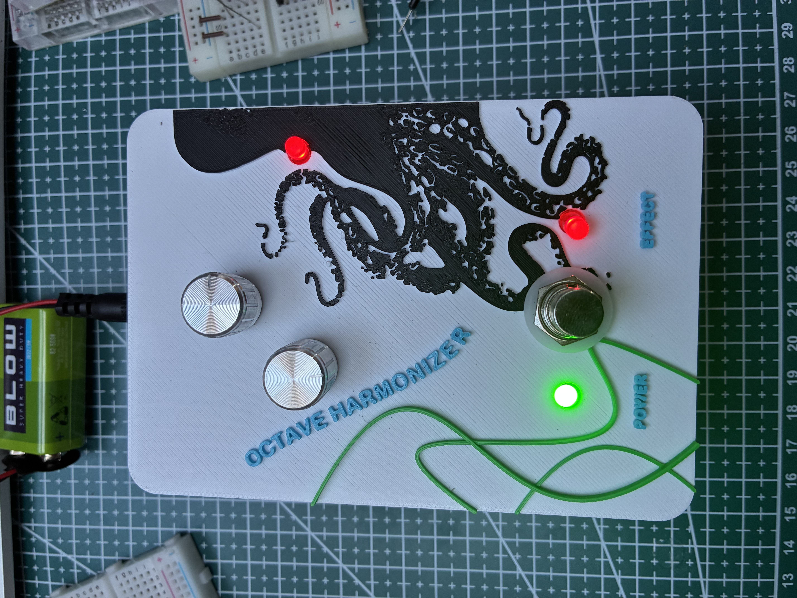
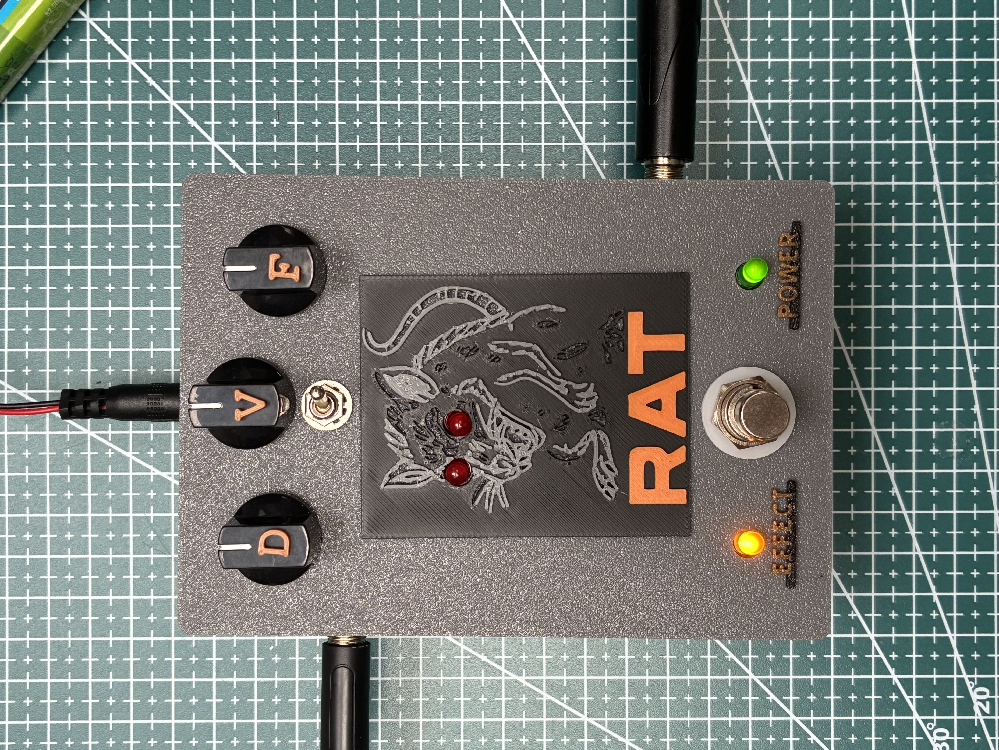

Archive repo where I shared my start in the audio-electronics world

# Guitar effects

This repository documents my personal journey into guitar and audio electronics — designing, prototyping, and refining analog and digital effects.

I'm exploring how analog circuitry and digital control can shape guitar tone — from simple transistor fuzzes to complex delay and modulation effects.
Each project reflects a step in learning design, layout, and sound-shaping.

## Projects

Listed in the order I built them.

| # | Project | Photo | What's inside |
|---|---------|-------|---------------|
| 1 | [Fuzz](01-fuzz) |  | schematic (KiCad), audio demo |
| 2 | [Tremolo](02-tremolo) |  | audio demo |
| 3 | [Octafuzz](03-octafuzz) |  | 3D enclosure (Fusion 360) |
| 4 | [Rat distortion](04-rat) |  | 3D enclosure (Fusion 360), audio demo |
| 5 | [PT2399 echo](05-echo) | — | schematic + PCB (KiCad) |

## Tools

- **KiCad** – schematics and PCB layouts
- **Fusion 360** – enclosure design, 3D printed

## Disclaimer

This repository was created for educational purposes only.
Please keep in mind that I'm still learning electronics, PCB and 3D design — so some projects might not be perfect, but they're part of my learning process.
